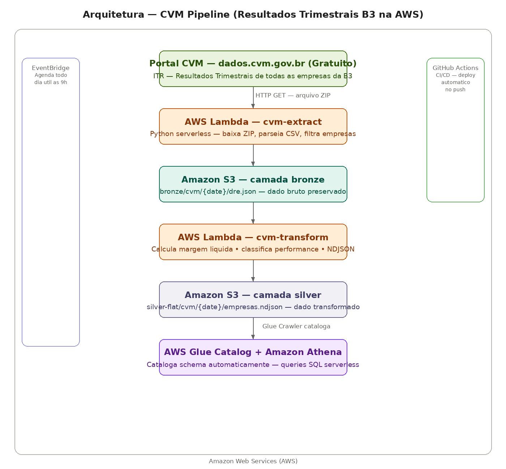

# CVM Pipeline — Resultados Trimestrais das Empresas da B3 na AWS

Pipeline de dados que extrai os resultados financeiros trimestrais das principais empresas da B3 diretamente do Portal de Dados Abertos da CVM, aplicando medallion architecture com camadas bronze e silver na AWS — primeiro projeto do portfólio usando Amazon Web Services.

## Arquitetura



**Ingestão:** Lambda Python baixa o arquivo ZIP da CVM, parseia o CSV com encoding latin-1, filtra as empresas selecionadas e extrai receita líquida e lucro líquido por trimestre.

**Bronze:** Dados brutos salvos no S3 em JSON — preservados para reprocessamento sem nova chamada à fonte.

**Silver:** Segundo Lambda transforma os dados calculando margem líquida, classificando performance e convertendo para NDJSON — uma linha por empresa — formato otimizado para o Athena.

**Catálogo:** Glue Crawler escaneia o S3 automaticamente e registra o schema no Glue Catalog sem necessidade de definição manual.

**Gold:** Athena consulta os dados diretamente do S3 via SQL serverless — sem cluster dedicado, paga por query executada.

**Agendamento:** EventBridge dispara o Lambda todo dia útil às 9h automaticamente.

**CI/CD:** GitHub Actions deploya os Lambdas automaticamente a cada push na pasta lambda/.

**Infraestrutura:** Toda infraestrutura provisionada via Terraform — S3, IAM Roles, Glue Database.

## Empresas monitoradas

| Empresa | CNPJ |
|---|---|
| Petrobras | 33.000.167/0001-01 |
| Vale | 33.592.510/0001-54 |
| Itaú Unibanco | 60.746.948/0001-12 |
| Bradesco | 60.038.016/0001-58 |
| Banco do Brasil | 00.000.000/0001-91 |
| WEG | 00.348.700/0001-00 |
| Magazine Luiza | 07.526.557/0001-00 |
| Ambev | 07.237.373/0001-20 |

## Tecnologias AWS

| Serviço | Função | Equivalente GCP |
|---|---|---|
| AWS Lambda | ETL serverless | Cloud Functions |
| Amazon S3 | Data Lake | Cloud Storage |
| AWS Glue Crawler | Catalogação automática | Data Catalog |
| AWS Glue Catalog | Metadados e schema | Data Catalog |
| Amazon Athena | Queries serverless | BigQuery |
| Amazon EventBridge | Agendamento | Cloud Scheduler |
| GitHub Actions | CI/CD | Cloud Build |
| Terraform | Infraestrutura como código | Terraform |

## Medallion Architecture

**Bronze (S3):** Arquivo JSON bruto exatamente como processado do ZIP da CVM — encoding corrigido, estrutura original preservada.

**Silver (S3 NDJSON):** Uma linha por empresa com métricas calculadas — margem líquida, classificação de performance e valores convertidos de milhares pra reais.

**Gold (Athena):** Dados consultáveis via SQL serverless — schema catalogado automaticamente pelo Glue Crawler.

## Queries no Athena

```sql
-- Ranking por receita
SELECT empresa, receita_liquida, lucro_liquido, margem_liquida_pct, classificacao_margem
FROM cvm_database.silver_flat
ORDER BY receita_liquida DESC;

-- Empresas com margem alta
SELECT empresa, margem_liquida_pct, lucro_liquido
FROM cvm_database.silver_flat
WHERE classificacao_margem = 'alta'
ORDER BY margem_liquida_pct DESC;

-- Comparativo receita vs lucro
SELECT empresa,
  receita_liquida,
  lucro_liquido,
  ROUND(lucro_liquido / receita_liquida * 100, 2) as margem_pct
FROM cvm_database.silver_flat
ORDER BY margem_pct DESC;
```

## Resultado do Q1 2026

| Empresa | Receita | Lucro | Margem |
|---|---|---|---|
| Petrobras | R$ 123,6 bi | R$ 32,7 bi | 26,49% — alta |
| Banco do Brasil | R$ 78,4 bi | R$ 3,1 bi | 3,96% — baixa |
| Itaú Unibanco | R$ 78,1 bi | R$ 5,2 bi | 6,7% — baixa |
| Vale | R$ 48,6 bi | R$ 10,1 bi | 20,95% — alta |
| Magazine Luiza | R$ 22,4 bi | R$ 3,8 bi | 17,3% — média |

## CI/CD com GitHub Actions

O pipeline de deploy é totalmente automatizado. A cada push na pasta `lambda/`:

1. GitHub Actions instala as dependências
2. Cria o ZIP da função
3. Faz deploy automático na AWS
4. Sem intervenção manual necessária

## Como rodar

### 1. Configurar credenciais AWS
```bash
aws configure
```

### 2. Criar infraestrutura
```bash
cd terraform
terraform init
terraform apply
```

### 3. Deploy dos Lambdas
```bash
# Extract
cd lambda/extract
pip install requests -t package/
cp main.py package/
cd package && zip -r ../function.zip .
aws lambda create-function --function-name cvm-extract ...

# Transform
cd lambda/transform
pip install boto3 -t package/
cp main.py package/
cd package && zip -r ../function.zip .
aws lambda create-function --function-name cvm-transform ...
```

### 4. Configurar Glue Crawler e Athena
```bash
aws glue create-crawler --name cvm-flat-crawler ...
aws glue start-crawler --name cvm-flat-crawler
```

## Autor

**Lucas Magalhães** — Engenheiro de Dados

[](https://github.com/lucasmagalhaess)
[](https://linkedin.com/in/lucasmagalhaes-data)
